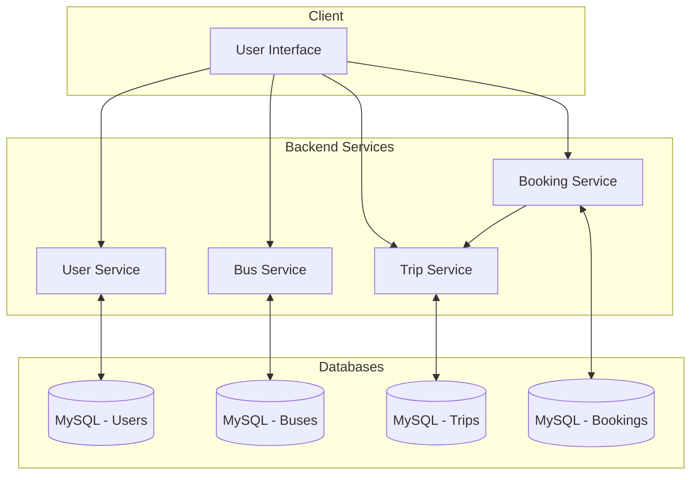

# 4bus Bus Booking Microservices

[](https://www.oracle.com/java/technologies/javase/jdk17-archive-downloads.html)
[](https://spring.io/projects/spring-boot)
[](https://maven.apache.org/)
[](LICENSE)

## 1. Overview

Welcome to **4bus**, a modern, scalable bus booking system built on a microservice architecture. This project provides a complete platform for users to search for bus routes, book tickets, and manage their reservations, while offering administrators the tools to manage the system's core components.

By leveraging the power of Spring Boot and a distributed architecture, 4bus achieves high availability, independent service deployment, and enhanced scalability, making it a robust solution for online ticketing.

## 2. Core Features

- **User Management**: Secure user registration, login, and profile management with JWT-based authentication.
- **Bus & Route Management**: Administrative capabilities to manage bus details, routes, and stops.
- **Trip & Schedule Planning**: Comprehensive tools for creating and managing trip schedules.
- **Dynamic Search**: Users can search for available trips based on origin, destination, and date.
- **Seat Reservation**: Real-time seat selection and booking.
- **Booking Management**: End-to-end booking workflow, from initiation to confirmation and cancellation.
- **Payment Integration**: Secure payment processing via PayOS integration.
- **Admin Dashboard APIs**: Powerful APIs for administrators to monitor and manage bookings, payments, and tickets with advanced filtering and soft-delete capabilities.

## 3. System Architecture

4bus is designed as a set of independent, loosely coupled microservices that communicate via REST APIs. This design ensures that each service can be developed, deployed, and scaled independently.

### Discovered Microservices

- **`user-service`**: Manages all user-related operations, including authentication, authorization, and profile management.
- **`bus-service`**: Handles the creation and management of bus information, including details, capacity, and amenities.
- **`trip-service`**: Manages trip schedules, routes, and pricing information.
- **`booking-service`**: Orchestrates the core booking process, handling reservations, seat selection, payment integration, and ticket generation.

### Architectural Flow

The system follows a standard microservice interaction pattern where a client request is routed to the appropriate service, which then interacts with the database or other services to fulfill the request.

**Simplified Request Flow:**
`Client (UI) -> Specific Microservice (e.g., booking-service) -> Database (MySQL)`

_(Note: In a production environment, an API Gateway would be added to centralize routing, and a Service Discovery server would manage service registration.)_

### Suggested Architecture Diagram (Mermaid)



## 4. Technologies Used

- **Programming Language**: Java 17
- **Framework**: Spring Boot 3.2.7
- **Data Persistence**:
  - Spring Data JPA
  - Hibernate
  - **Database**: MySQL
- **API & Security**:
  - Spring Web (REST APIs)
  - Spring Security (JWT Authentication & Authorization)
- **API Documentation**: SpringDoc (OpenAPI 3 / Swagger UI)
- **Build & Dependency Management**: Apache Maven
- **Utilities**:
  - Lombok
  - MapStruct
  - PayOS Java Library

## 5. Project Structure

```
.
├── booking-service/  # Handles ticket booking, payments, and seat reservations
├── bus-service/      # Manages bus details and information
├── trip-service/     # Manages trip schedules, routes, and pricing
├── user-service/     # Manages user accounts and authentication
└── README.md         # This file
```

## 6. Prerequisites

- **Java JDK 17+**
- **Apache Maven 3.8+**
- **MySQL Server 8.0+** (or a compatible Docker container)
- **API Testing Tool** (e.g., Postman, Insomnia)

## 7. Getting Started (Manual Setup)

As the project does not currently include Docker Compose, follow these steps to run the services manually.

### 1. Database Setup

For each service (`user-service`, `bus-service`, `trip-service`, `booking-service`), you need to create a separate MySQL database.

Example for `user-service`:

```sql
CREATE DATABASE `4BUS_UserServiceDB` CHARACTER SET utf8mb4 COLLATE utf8mb4_unicode_ci;
```

Repeat this for `4BUS_BusServiceDB`, `4BUS_TripServiceDB`, and `4BUS_BookingServiceDB`.

### 2. Configuration

Review the `application.properties` file in each service's `src/main/resources` directory. Ensure the database URL, username, and password match your local MySQL setup.

**Example (`user-service/src/main/resources/application.properties`):**

```properties
spring.datasource.url=jdbc:mysql://localhost:3306/4BUS_UserServiceDB?createDatabaseIfNotExist=true
spring.datasource.username=root
spring.datasource.password=your_password
```

### 3. Build and Run Services

Open a separate terminal for each microservice and run the following commands. It is recommended to start them in any order, as they are independently deployable.

**For `user-service`:**

```sh
cd user-service
mvn clean install
mvn spring-boot:run
```

**For `bus-service`:**

```sh
cd bus-service
mvn clean install
mvn spring-boot:run
```

**For `trip-service`:**

```sh
cd trip-service
mvn clean install
mvn spring-boot:run
```

**For `booking-service`:**

```sh
cd booking-service
mvn clean install
mvn spring-boot:run
```

### 4. Service Ports

- **User Service**: `8080`
- **Bus Service**: `8081`
- **Trip Service**: `8082`
- **Booking Service**: `8083`

## 8. API Endpoints & Documentation

Each microservice includes SpringDoc, which automatically generates OpenAPI documentation. Once the services are running, you can access their Swagger UI at the following URLs:

- **User Service**: `http://localhost:8080/swagger-ui/index.html`
- **Bus Service**: `http://localhost:8081/swagger-ui/index.html`
- **Trip Service**: `http://localhost:8082/swagger-ui/index.html`
- **Booking Service**: `http://localhost:8083/swagger-ui/index.html`

### Key Endpoints

- **User Service**:
  - `POST /api/users/register`: Register a new user.
  - `POST /api/auth/login`: Authenticate and receive a JWT token.
  - `GET /api/users/my-info`: Get current user's profile.
- **Bus Service**:
  - `POST /api/buses`: (Admin) Create a new bus.
  - `GET /api/buses`: Get a list of all buses.
- **Trip Service**:
  - `POST /api/trips/search`: Search for available trips.
  - `GET /api/trips/{id}`: Get details for a specific trip.
- **Booking Service**:
  - `POST /api/booking`: Initiate a new booking.
  - `GET /api/admin/bookings`: (Admin) Get a list of all bookings.
  - `PUT /api/admin/bookings/{id}`: (Admin) Update a booking.

## 9. Contributing

Contributions are welcome! Please follow these steps:

1.  **Fork the repository.**
2.  **Create a new branch** (`git checkout -b feature/YourFeature`).
3.  **Make your changes.**
4.  **Run tests** by executing `mvn clean test` in the respective service directory.
5.  **Commit your changes** (`git commit -m 'Add some feature'`).
6.  **Push to the branch** (`git push origin feature/YourFeature`).
7.  **Open a Pull Request.**

## 10. Roadmap (Suggested Enhancements)

- **API Gateway**: Implement Spring Cloud Gateway to centralize routing, security, and rate limiting.
- **Service Discovery**: Integrate Eureka or Consul for dynamic service registration and discovery.
- **Containerization**: Add `Dockerfile` for each service and a `docker-compose.yml` file for one-command setup.
- **Real-time Updates**: Use WebSockets for real-time seat availability updates.
- **CI/CD**: Set up a CI/CD pipeline using GitHub Actions to automate builds, tests, and deployments.
- **Distributed Logging**: Implement a centralized logging solution like the ELK Stack.

## 11. License

This project is licensed under the MIT License. See the [LICENSE](LICENSE) file for details.

## 12. Contact

For issues, questions, or suggestions, please open an issue on the GitHub repository.
